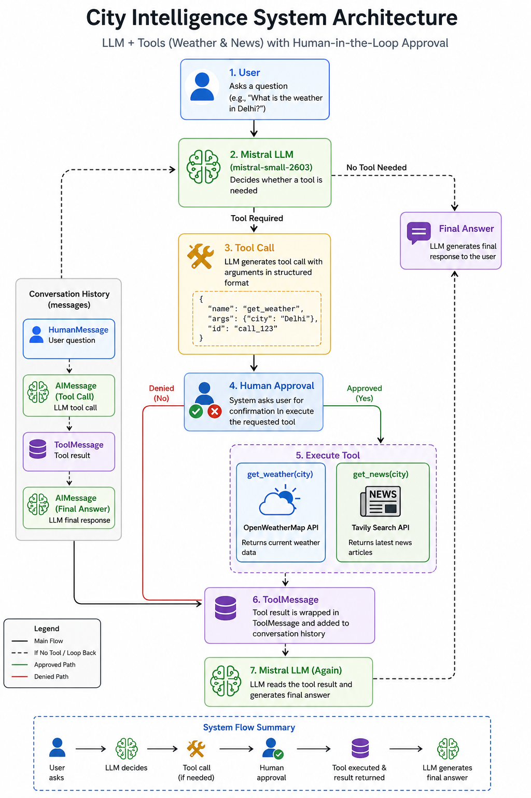

# 🌦️ City Intelligence System

A simple **LLM-powered City Intelligence System** built with **LangChain and Mistral AI**.

The system allows an LLM to decide when it needs external tools to answer a user's question. It currently provides two tools:

- 🌤️ **Weather Tool** — Gets current weather information using OpenWeatherMap.
- 📰 **News Tool** — Gets the latest city-related news using Tavily.

The project also implements **human-in-the-loop tool approval**, meaning the user must explicitly approve a tool execution before the application calls the external API.

## ✨ Features

- 🤖 Mistral LLM integration
- 🛠️ LangChain tool calling
- 🌤️ Real-time weather data through OpenWeatherMap
- 📰 Latest news through Tavily
- 🔐 API keys stored using environment variables
- 👤 Human approval before tool execution
- 🔄 Multi-step tool-calling loop
- 💬 Conversation history maintained during the session

## 🏗️ Architecture



## 🛠️ Technologies Used

| Technology | Purpose |
|---|---|
| Python | Core programming language |
| LangChain | Tool creation and LLM integration |
| Mistral AI | Large Language Model |
| OpenWeatherMap | Weather API |
| Tavily | Web/news search |
| python-dotenv | Environment variable management |
| Requests | HTTP requests |
| Rich | Terminal output formatting |

## 📁 Project Structure

```text
city-intelligence-system/
│
├── main.py
├── .env
├── .gitignore
├── requirements.txt
└── README.md
```

> **Important:** `.env` should exist locally but must NOT be committed to GitHub.

## 🔑 Environment Variables

Create a `.env` file in the project root:

```env
OPENWEATHER_API_KEY=your_openweather_api_key
TAVILY_API_KEY=your_tavily_api_key
MISTRAL_API_KEY=your_mistral_api_key
```

Never publish real API keys on GitHub.

## 📦 Installation

### 1. Clone the repository

```bash
git clone https://github.com/YOUR_USERNAME/city-intelligence-system.git
cd city-intelligence-system
```

### 2. Create a virtual environment

```bash
python -m venv .venv
```

Activate it on Windows:

```powershell
.venv\Scripts\activate
```

### 3. Install dependencies

```bash
pip install -r requirements.txt
```

### 4. Create `.env`

Add your API keys:

```env
OPENWEATHER_API_KEY=your_key
TAVILY_API_KEY=your_key
MISTRAL_API_KEY=your_key
```

### 5. Run the application

```bash
python main.py
```

## 💻 Example

```text
City Intelligence System
Type exit to quit

YOU: What is the weather in Delhi?

do you want confirm to execute get_weather. yes/no : yes

Tool Results:
The weather in Delhi: clear sky, 31 C

AI: The current weather in Delhi is 31°C with clear skies.
```

Another example:

```text
YOU: Give me the latest news in Visakhapatnam.

do you want confirm to execute get_news. yes/no : yes

Tool Results:
Latest news in Visakhapatnam:
...
```

## 🔄 How Tool Calling Works

The application uses LangChain's `bind_tools()`:

```python
llm_with_tools = llm.bind_tools(
    [get_weather, get_news]
)
```

The LLM receives the available tool definitions and can decide whether a tool is necessary.

For example, when the user asks:

```text
What is the weather in Delhi?
```

The LLM may generate a tool call similar to:

```python
{
    "name": "get_weather",
    "args": {
        "city": "Delhi"
    }
}
```

The application then:

1. Reads the tool call.
2. Asks the user for permission.
3. Executes the requested tool.
4. Creates a `ToolMessage`.
5. Sends the tool result back to the LLM.
6. Lets the LLM generate the final response.

This demonstrates the fundamental pattern behind **LLM tool-using agents**.

## 👤 Human-in-the-Loop

Before executing a tool, the application asks for confirmation:

```text
do you want confirm to execute get_weather. yes/no:
```

If the user enters:

```text
yes
```

the tool executes.

If the user enters:

```text
no
```

the tool execution is denied.

This provides a basic safety layer between the LLM and external APIs.

## 🔐 Security

API keys are loaded using environment variables:

```python
API_KEY = os.getenv("OPENWEATHER_API_KEY")
```

Do not hard-code API keys in Python.

Add the following to `.gitignore`:

```gitignore
.env
.venv/
__pycache__/
*.pyc
```

Before pushing to GitHub, verify that your `.env` file is not being tracked:

```bash
git status
```

If `.env` was accidentally committed, **revoke the exposed API keys immediately** and remove them from the repository history.

## 🚀 Future Improvements

Possible improvements for this project:

- [ ] Add more tools such as currency conversion and maps
- [ ] Add automatic location detection
- [ ] Add structured tool responses
- [ ] Add better error handling
- [ ] Add asynchronous tool execution
- [ ] Add LangGraph for agent orchestration
- [ ] Add a Streamlit web interface
- [ ] Add persistent conversation memory
- [ ] Add tool execution logging
- [ ] Add unit tests
- [ ] Add Docker support
- [ ] Deploy the application as a web service

## 🎯 Learning Goals

This project demonstrates understanding of:

- LLM tool calling
- LangChain `@tool`
- `bind_tools()`
- `ToolMessage`
- Tool-call loops
- External API integration
- Environment variables
- Human-in-the-loop systems
- Basic agent architecture

## 📌 Disclaimer

This project is intended for educational purposes. Weather and news information depends on the availability and accuracy of the external APIs.

## 📄 License

This project is available under the MIT License.